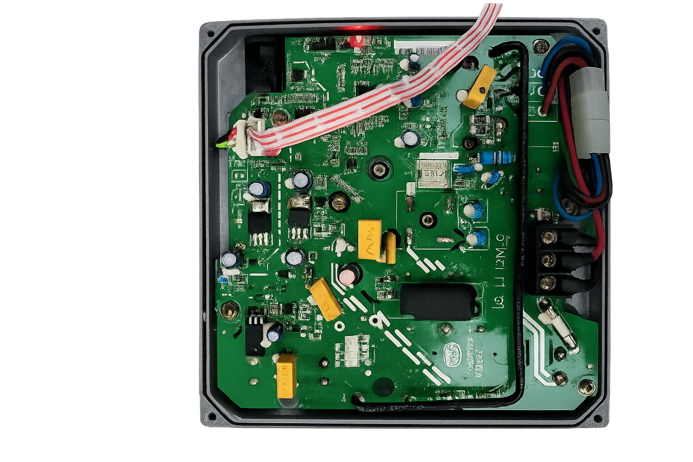
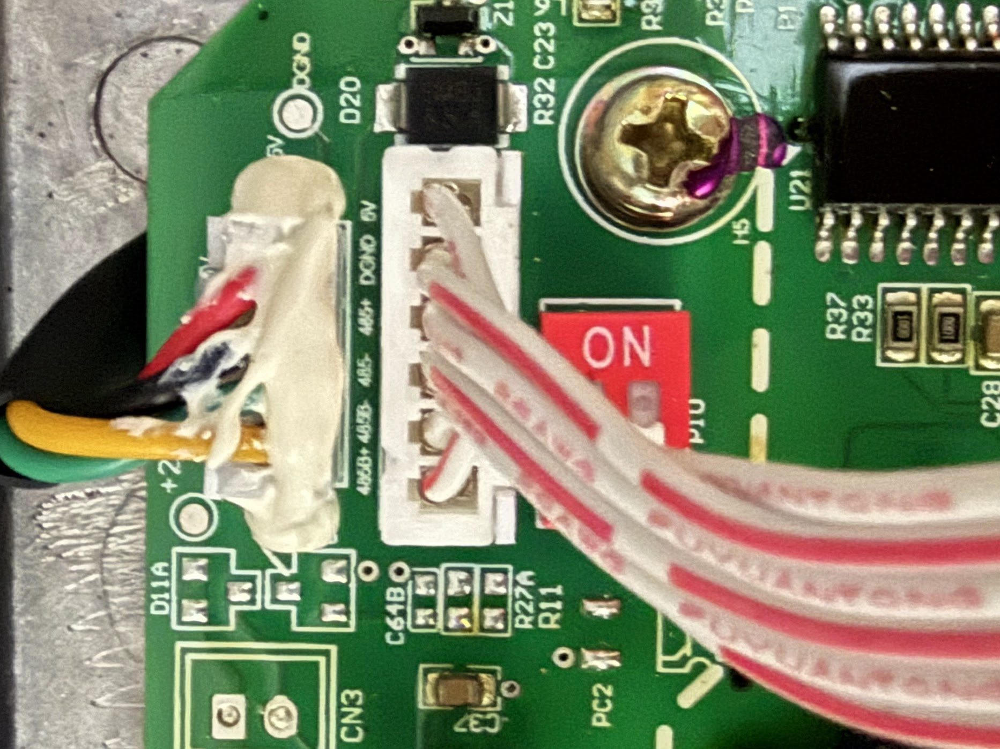
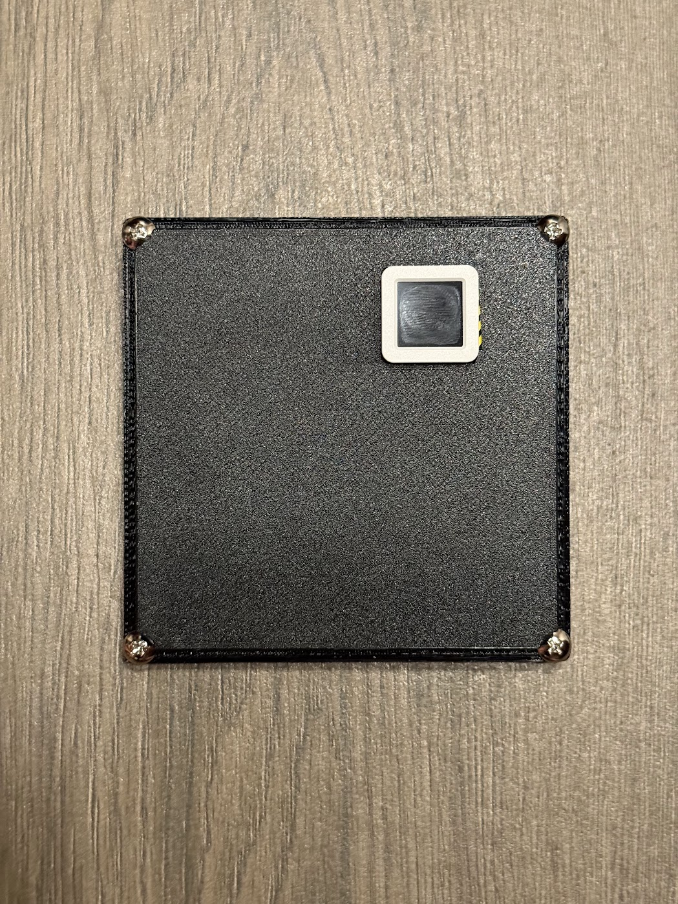
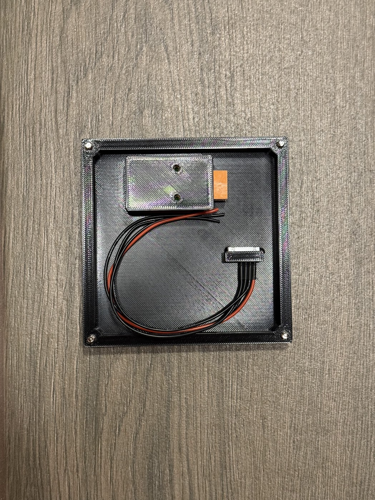

# iLiving / Lingxiao Variable-Speed Pool Pump Controller

This repository documents and implements the proprietary RS-485 link between
the removable keypad and motor controller in an **iLiving ILG8PP390-VS** pool
pump. It contains:

- a PowerShell controller proven against the real pump;
- an ESPHome component for an M5Stack AtomS3 and Atomic RS485 Base;
- a PC pump emulator for testing either the AtomS3 or original keypad; and
- logic captures and keypad firmware analysis used to recover the protocol.

The protocol is not standard Modbus RTU. It uses a Modbus CRC-16, but it has no
Modbus address, function code, or register map.

## Safety

Pool pumps combine mains voltage, water, rotating equipment, and stored charge.
Work on the low-voltage communication connector only, with pump power removed
while changing wiring. Follow the pump manual and use a qualified electrician
for mains wiring.

- Disconnect the original keypad before another device transmits on its bus.
- Never connect two RS-485 transmitters to the pump at the same time.
- Do not connect the pump cable's `+5V` wire to the Waveshare adapter.
- Do not connect the pump's `+5V` wire to the Atomic base's `DC24V` terminal.
- Confirm polarity and protocol passively before sending commands to an
  untested model.
- The supplied ESPHome configuration defaults to sending a stop demand after
  boot. Read its startup-mode notes before installing it on operating equipment.

This is an independent reverse-engineering project. It is not affiliated with
or endorsed by iLiving, Guangdong Lingxiao Pump Industry, M5Stack, or the other
brands named below.

## Current Status

| Path | Result |
|---|---|
| Waveshare USB-RS485 -> real ILG8PP390-VS | **Confirmed:** complete replies, 1400/1800/2000 RPM, stop, and restart |
| Original keypad -> real ILG8PP390-VS | **Confirmed:** captured and decoded at startup, prime, presets, custom speeds, and stop |
| AtomS3 + Atomic RS485 Base -> PC emulator | **Confirmed:** 204/204 requests accepted in the recorded bench run; start, stop, RPM ramping, faults, and offline handling tested |
| Original keypad -> PC emulator | **Confirmed:** prime behavior and all 11 documented faults tested |
| AtomS3 + Atomic RS485 Base -> real pump | **Confirmed:** direct communication and pump control using pump `485A+` -> Atomic `A` and pump `485A-` -> Atomic `B` |

The original keypad uses an STM32F030-family MCU. Its flash was read twice with
matching output at RDP Level 0, without erase, unlock, or write operations.

## How We Reverse Engineered It

This project did not begin with a known Modbus register map or a service manual
for the keypad link. We had a six-wire cable, a running pump, and a detachable
keypad whose traffic had to be observed without disrupting it. The final
protocol came from combining electrical measurements, controlled captures,
failed replay experiments, firmware analysis, and physical pump tests. No
single method was sufficient by itself.

### Hardware and tools

| Item | How it was used |
|---|---|
| iLiving `ILG8PP390-VS` and original keypad | Reference system for every known-good state and final command test |
| Breakout connector and soldered PCB tap points | Allowed the keypad to be connected or isolated while the bus was monitored |
| Waveshare USB TO RS485 adapter | Captured byte streams and later transmitted generated pump commands |
| FX2LP Saleae-compatible logic analyzer | Passively observed both differential pairs and verified baud rate, polarity, and timing |
| ST-Link V2 clone | Read the keypad MCU and inspected live SRAM over SWD |
| STM32CubeProgrammer 2.22 | Identified the MCU, checked RDP, read flash, and performed read-only HotPlug memory inspection |
| PulseView and `sigrok-cli` | Recorded and decoded the logic-analyzer captures |
| PowerShell | Automated repeated captures, timestamped serial logging, frame replay, timing, and reply validation |
| Python | Implemented the stateful pump emulator and repeatable protocol tests |
| M5Stack AtomS3 and Atomic RS485 Base | Exercised the ESPHome controller against both the PC emulator and real pump |

### Establishing the physical bus

The keypad harness is labeled `485A+`, `485A-`, `485B+`, `485B-`, `GND`, and
`+5V`. The first byte captures were misleading because the keypad was talking
without a pump and was already in its communication-error behavior. We also
learned that matching the Waveshare `A+` and `B-` labels directly to the pump
labels inverted the data. The working mapping had to be established
empirically and then checked against the logic analyzer.

Once tap points and a disconnectable harness were available, the logic analyzer
could listen while the original keypad and pump communicated normally. The
Waveshare was disconnected during passive captures so it could not contend for
the bus. Probing all four data wires showed that normal keypad polling was on
the `485A` pair. The `485B` pair remained silent during those captures.

One especially useful experiment was to unplug the keypad while leaving the
pump running and listen to the bus. The pump sent nothing by itself. That
established that the keypad is the polling master and the drive only replies
after a request. It also explained why simply opening a serial port and waiting
could never discover the pump protocol.

### Capturing behavior instead of guessing fields

The inexpensive FX2LP analyzer could record only about 600 ms before hitting
its capture limit. `loop-capture.ps1` worked around that limitation by launching
many short `sigrok-cli` captures back to back. We recorded the pump in known
states rather than collecting one long, unlabeled trace: each preset, custom
speeds from 1000 through 3450 RPM, a speed transition, a complete shutdown, a
power-on transition, and the start of the ten-minute prime cycle.

Those controlled changes let us correlate bytes with real behavior. They also
established the approximately 61 ms request cadence and the pump's reply timing.
The shutdown and startup captures were particularly valuable because they
contained state transitions that did not appear at a steady speed.

### The convincing 9600-baud false lead

Our first UART decode at 9600 baud produced repeatable-looking `B5`, `A5`, `BD`,
and `F6` messages. Some apparent requests were three bytes, others four or five.
Because the same patterns appeared across captures, they looked like a real
variable-length protocol. We classified the messages, replayed captured prime
sequences, and tried to associate individual bytes with speed.

The pump did not accept those replays. Several practical mistakes made the
failure harder to interpret: some early emulator tests still had the original
keypad transmitting on the bus, and `Start-Sleep -Milliseconds 1` on Windows
actually introduced delays around 15 ms, far too coarse for the observed
timing. After eliminating bus contention and replacing sleeps with stopwatch
timing, the replay still failed. That forced us to question the decode itself.

The important lesson was that a UART alias can look structured and repeatable.
The apparent 9600-baud frames were a decoding artifact, not random noise, so
frequency tables and repeated patterns alone were not enough to validate them.

### Reading the keypad firmware safely

The keypad PCB exposed pads labeled `NRST`, `SWD`, `SWK`, `GND`, and `3.3V`.
Before connecting the ST-Link, we treated `3.3V` as the debugger's target-voltage
reference and explicitly avoided any unlock or erase operation. STM32CubeProgrammer
identified an STM32F05x/F030x8-class Cortex-M0 with 64 KB of flash and RDP Level
0. Two complete reads produced the same SHA-256 hash, giving us a verified
backup before any live inspection.

Static firmware analysis found two initialized UART stacks. `USART2` built a
request roughly every 60 ms and had a recognizable transmit buffer. `USART1`
used a separate parser and command family, which is why the silent `485B` pair
is still treated as a possible service or external-control interface rather
than declared unused.

Read-only HotPlug SRAM reads then connected the firmware to physical keypad
actions. While the keypad remained attached to the real pump, selecting the
three presets changed the `USART2` value field to `0x0C3A`, `0x0982`, and
`0x1770`, corresponding to 1800, 1400, and 3450 RPM on this keypad. The live
buffer showed a 12-byte structure beginning with `01 70`, a sequence byte, a
big-endian demand value, and a little-endian additive checksum. Comparing more
speeds revealed the scaling rule `floor(RPM * 6000 / 3450)`.

This was the point where firmware became a second source of truth. It disproved
the old 9600-baud interpretation and gave us exact bytes to search for in the
electrical captures. Re-decoding the bus at 38400 baud with the correct inverted
polarity exposed the same `01 70` traffic on the wire.

### Finding the missing on-wire bytes

The firmware buffer explained the first 12 bytes but not the whole transmitted
request. Comparing candidate frames with the captured tail bytes showed that a
standard Modbus CRC-16 was appended after the additive checksum. The complete
request was therefore 14 bytes, not 12. The same construction appeared at the
end of the pump response: 34 data bytes, a two-byte additive checksum, and a
two-byte Modbus CRC, for 38 bytes total.

That correction was the breakthrough. A replay containing the 12-byte inner
frame plus the CRC received a valid 38-byte response on its first request. The
reply parser was then made deliberately strict: it searches arbitrary serial
chunks for `01 70`, checks the expected sequence and shape, verifies the
additive checksum, and finally verifies the CRC. Single `00` bytes and partial
USB reads are treated as noise instead of pump acknowledgements.

### Proving control on the real pump

With the original keypad disconnected, the Waveshare sent sustained 14-byte
requests at the observed cadence. The pump returned complete replies and was
physically confirmed at 1400, 1800, and 2000 RPM. A zero demand stopped the
motor, and a later 1800 RPM demand restarted it. One timing soak returned 120
valid replies for 120 requests with no noise bytes.

Those tests also identified useful reply fields. The pump reports its accepted
demand at bytes `12..13`, an actual-speed value at `14..15`, and an echo of the
requested demand at `32..33`. Stop and restart captures showed those fields
ramping down and back up with the motor rather than changing only in software.

### Testing both sides without the pump

After the real control path worked, `pump_emulator.py` was built from a captured
38-byte response. It validates keypad/controller requests, echoes the sequence
and demand, simulates acceleration and deceleration, and can inject dropped
replies, bad CRCs, offline periods, and documented fault codes.

Connecting the original keypad to that emulator provided an independent test of
the reply direction. The keypad entered prime, commanded 3450 RPM, accepted the
simulated speed ramp, and displayed all 11 injected fault codes. It also exposed
the keypad's fault workflow: one power-button press acknowledges the error and
leaves the pump off; a second press starts prime again.

Finally, the AtomS3 and Atomic RS485 Base were connected to the same emulator.
The recorded bench run accepted and answered 204 of 204 requests while the
display followed stop, ramp, run, fault, and offline states. Protocol fixtures
and Python tests now preserve the request, reply, checksum, CRC, scaling, fault,
and stream-recovery behavior that was learned from the hardware.

The AtomS3 was then connected to the real pump with pump `485A+` wired to Atomic
`A`, pump `485A-` wired to Atomic `B`, and a shared ground. Direct communication
and pump control were confirmed on 2026-07-15. This closes the final
AtomS3-to-real-pump validation gap while keeping the PC emulator available for
tests that do not need a running motor.

## Protocol Summary

### Electrical and timing

- Physical layer: half-duplex RS-485
- Active keypad pair: `485A+` / `485A-`
- Serial format: 38400 baud, 8 data bits, no parity, 1 stop bit
- Request cadence: approximately 61 ms
- Keypad role: master; the pump remains silent until polled
- Request length: 14 bytes
- Reply length: 38 bytes

The earlier apparent 9600-baud `B5/A5/BD/F6` traffic was a logic-analyzer decode
alias. Valid captures decode as 38400 8N1 with inverted polarity on the probed
`485A+` channel.

### Request

```text
01 70 <seq> <status> 00 0C 00 00 <value_hi> <value_lo> <sum_lo> <sum_hi> <crc_lo> <crc_hi>
```

| Bytes | Meaning |
|---|---|
| `0..1` | Fixed header `01 70` |
| `2` | Sequence number |
| `3` | Status/control byte; zero in the validated command path |
| `4..7` | Fixed shape bytes `00 0C 00 00` |
| `8..9` | Big-endian speed demand value |
| `10..11` | Little-endian 16-bit sum of bytes `0..9` |
| `12..13` | Little-endian Modbus CRC-16 of bytes `0..11` |

The speed conversion is:

```text
value = floor(RPM * 6000 / 3450)
RPM   = value * 3450 / 6000
```

`value = 0` stops the motor. Known values include `0x0982` for 1400 RPM,
`0x0C3A` for 1800 RPM, and `0x1770` for 3450 RPM.

### Reply

The complete reply is validated before any state is accepted:

| Bytes | Meaning used by this project |
|---|---|
| `0..1` | Header `01 70` |
| `2` | Echoed sequence |
| `3` | Pump fault code, zero when clear |
| `4..5` | Shape bytes `00 0C` |
| `12..13` | Accepted demand value, big-endian |
| `14..15` | Actual speed value, big-endian |
| `32..33` | Echoed demand value, big-endian |
| `34..35` | Little-endian 16-bit sum of bytes `0..33` |
| `36..37` | Little-endian Modbus CRC-16 of bytes `0..35` |

Several reply fields remain unnamed. Captures from more operating conditions
are welcome; do not assign meanings from a single changing sample.

## Internal Keypad Bus vs. External Automation

The iLiving manual describes an external RS-485 mode compatible with Pentair
automation and says external keypad and RS-485 control are mutually exclusive.
That interface must not be confused with the internal `01 70` keypad protocol
implemented here.

The removable keypad cable has two differential pairs. `485A` carries the
confirmed `01 70` traffic. `485B` is silent during normal passive captures, but
the dumped keypad firmware initializes a second UART and a separate command
parser. It is plausible that this relates to an external or service interface,
but its physical mapping and protocol have not been proven.

Pentair, Jandy, and Hayward pumps are therefore **not** implied to be compatible
with this project merely because related Lingxiao pumps can connect to those
automation systems.

## Compatibility Research

Research was last refreshed on **2026-07-13**. Compatibility labels mean:

- **Confirmed**: this exact model exchanged valid `01 70` frames on hardware.
- **OEM-family candidate**: manufacturer documentation, certification data, or
  an FCC model declaration places it in the same pump family. The internal bus
  still needs a passive capture before use.
- **Similar-controller candidate**: the keypad, operating behavior, and fault
  table closely match, but no direct OEM-family declaration was found.

| Confidence | Brand / series | Models | Evidence | Internal `01 70` protocol |
|---|---|---|---|---|
| Confirmed | iLiving | `ILG8PP390-VS` | Physical captures, firmware analysis, and successful control in this repository | Confirmed |
| OEM-family candidate | iLiving | `ILG8PP130-VS`, `ILG8PP220-VS` | Same official three-model manual, controller description, speed range, prime behavior, and fault table | Unverified |
| OEM-family candidate | LX / Key Lander | `SHP130-VS`, `SFP220-VS`, `SWP390-VS` | Lingxiao product/certification records and the same model-family manuals | Unverified |
| OEM-family candidate | Lingxiao Relaax | `Relaax130-VS`, `Relaax220-VS`, `Relaax390-VS` | Manufacturer identity, matching certifications, and Lingxiao's FCC model declaration | Unverified; revision risk |
| OEM-family candidate | Trevi / Innovaqua | `SPH130-VS`, `SPH220-VS`, `SPH390-VS` | Official manual has the same controller, defaults, 10-minute prime, and 11-code fault table; Trevi lists the underlying `SFP220-VS` / `SWP390-VS` model names | Unverified |
| OEM-family candidate | Aqua Expert | `VSP13-Pro`, `VSP22-Pro`, `VSP39-Pro` | Included in Lingxiao's FCC model declaration and matching ENERGY STAR performance records | Unverified; current products add Wi-Fi |
| OEM-family candidate | Illuminex AquaPump | `LU-VS130`, `LU-VS220`, `LU-VS390` | Included in Lingxiao's FCC model declaration; official manual and specifications match the family | Unverified; current products add Wi-Fi |
| Similar-controller candidate | Trevoli SPV | `SPV100`, `SPV200`, `SPV300` | Distributor manual shows the same 1.3/2.2/3.9 HP grouping, 450-3450 RPM range, keypad behavior, prime cycle, defaults, and fault table | Unverified; OEM relationship not established |

The EPA ENERGY STAR dataset gives the iLiving, Lingxiao/LX/Key Lander, Trevi,
and Aqua Expert equivalents identical certified performance values within each
horsepower class. For example, all researched 3.9 HP entries report WEF `7.262`,
HHP `1.808`, and the same low/high test-point RPM and flow values. This is strong
evidence of a shared hydraulic and drive platform, but it is not proof that every
controller revision runs the same serial firmware.

### Revision risk

The newer Lingxiao manual filed with the FCC groups all three horsepower classes
and the iLiving, Relaax, SPH, VSP, and LU aliases under one model declaration.
It also adds Smart Life Wi-Fi support and fault codes not present in the older
iLiving keypad manual (`E030`, `E040`, `E095`, and `LOF`). A visually identical
or identically named pump may therefore contain a newer controller revision.

No public implementation or register map for the internal `01 70` protocol was
found under the researched iLiving or Lingxiao model numbers. Do not describe
this protocol as a known Modbus register set.

## Identifying Another Pump Safely

1. Record the exact brand, model, serial label, controller label, keypad photos,
   connector labels, and manual revision.
2. Compare its speed range, preset defaults, 10-minute prime behavior, and fault
   table with the documents linked below.
3. With pump power off, identify ground and measure supply voltage before
   attaching any analyzer. Do not infer pinout from wire color.
4. Reconnect the original keypad and capture passively. A logic analyzer may
   listen in parallel, but a USB-RS485 adapter must not transmit.
5. Look for 14-byte `01 70` requests every approximately 61 ms at 38400 8N1 and
   38-byte replies with valid additive checksums and Modbus CRC-16.
6. If that fingerprint differs, stop. Add a new protocol variant instead of
   trying this controller unchanged.
7. For a matching fingerprint, disconnect the keypad and make the first active
   test with a zero-speed demand while watching the pump and serial reply.

To test only a detached keypad without connecting its pump, follow the
[`Offline Keypad Compatibility Test`](docs/keypad-compatibility-test.md). It
checks both validated keypad requests and the keypad's handling of complete
speed, state, and fault replies.

Appearance alone is not enough. Product certification tables can also place
unrelated models next to one another; only explicit family evidence and a bus
capture should move a model into the supported list.

## Hardware and Wiring

### Proven Waveshare-to-pump wiring

The following mapping is specific to the labels on the tested iLiving harness:

| Pump cable | Waveshare USB TO RS485 |
|---|---|
| `485A-` | `A+` |
| `485A+` | `B-` |
| `GND` | `GND` |
| `+5V` | Not connected |
| `485B+`, `485B-` | Not connected for normal keypad emulation |

The crossed labels were established empirically on this pump. They do not mean
all RS-485 products use reversed labels.

For passive logic capture, the tested channel assignment is:

| Pump cable | Logic analyzer |
|---|---|
| `485A-` | `D0` |
| `485A+` | `D1` |
| `485B-` | `D2` |
| `485B+` | `D3` |
| `GND` | `GND` |

The usable UART stream decodes on `D1` with RX inversion enabled.

### Proven AtomS3-to-pump wiring

This mapping was validated on the real iLiving ILG8PP390-VS on 2026-07-15:

| Pump cable | Atomic RS485 Base |
|---|---|
| `485A+` | `A` |
| `485A-` | `B` |
| `GND` | `G` |
| `+5V` | Not connected |
| `485B+`, `485B-` | Not connected |

Power the AtomS3 through USB-C. Leave the Atomic base's `DC24V` terminal
disconnected; the pump's `+5V` wire is not a suitable input for that terminal.

### PC emulator to Atomic RS485 Base

For an isolated bench setup with no pump or keypad connected:

| Waveshare USB-RS485 | Atomic RS485 Base |
|---|---|
| `A+` | `A` |
| `B-` | `B` |
| `GND` | `G` |

Power the Waveshare and AtomS3 through their own USB connections. Leave the
Atomic base's `DC24V` terminal disconnected.

### Hardware photos and M5Stack adapter plate

These photos document the tested pump electronics, communication connector,
and the finished AtomS3 installation. The controller is mounted in a custom
3D-printed adapter plate that measures 115 x 115 mm overall and holds the
AtomS3 and Atomic RS485 Base behind the panel.

| Pump controller board | Communication connector detail |
|---|---|
|  |  |

| Finished adapter plate | Adapter plate interior |
|---|---|
|  |  |

The enclosure design files are ready to download or modify:

- [M5Stack Pump Adapter Plate STEP model](hardware/cad/m5stack-pump-adapter-plate.step)
- [M5Stack Pump Adapter Plate dimensioned drawing (PDF)](hardware/cad/m5stack-pump-adapter-plate-drawing.pdf)

The drawing uses millimeters and shows the 115 x 115 mm plate, 24.2 x 24.2 mm
AtomS3 opening, and 4 mm corner mounting holes. Check the dimensions against
your enclosure before printing or drilling.

## Quick Start

### Probe or control the real pump with the Waveshare

Confirm that the keypad is disconnected and only the three proven Waveshare
wires are attached. Replace `COM3` as needed.

Probe communication with a stop demand and exit after the first complete reply:

```powershell
powershell -NoProfile -ExecutionPolicy Bypass -File ".\replay-firmware-master-frame.ps1" `
  -Port COM3 -Rpm 0 -Cycles 50 -StopOnMeaningfulReply
```

Send a sustained 1800 RPM command:

```powershell
powershell -NoProfile -ExecutionPolicy Bypass -File ".\replay-firmware-master-frame.ps1" `
  -Port COM3 -Rpm 1800 -Cycles 300
```

The script rejects incomplete, malformed, checksum-failing, and CRC-failing
replies. It logs every transmitted frame and received byte.

### Run the PC pump emulator

List serial ports:

```powershell
powershell -NoProfile -ExecutionPolicy Bypass -File ".\run-pump-emulator.ps1" -ListPorts
```

Start the emulator:

```powershell
powershell -NoProfile -ExecutionPolicy Bypass -File ".\run-pump-emulator.ps1" -Port COM3
```

Run the automatic fault demonstration:

```powershell
powershell -NoProfile -ExecutionPolicy Bypass -File ".\run-pump-emulator.ps1" `
  -Port COM3 -FaultDemo -FaultHoldSeconds 3 -FaultClearSeconds 1 `
  -ExitAfterFaultDemo
```

See [`esphome/README.md`](esphome/README.md) for AtomS3 wiring, firmware build,
startup modes, web controls, emulator controls, and original-keypad fault tests.
For a repeatable compatibility test of another detached keypad, use
[`docs/keypad-compatibility-test.md`](docs/keypad-compatibility-test.md).

### Capture the keypad bus

The inexpensive FX2 logic analyzer used here is limited to approximately 600 ms
per capture. `loop-capture.ps1` repeatedly invokes `sigrok-cli` as a workaround:

```powershell
powershell -NoProfile -ExecutionPolicy Bypass -File ".\loop-capture.ps1" -Label "my-test"
```

Decode one capture with:

```powershell
& "C:\Program Files\sigrok\sigrok-cli\sigrok-cli.exe" `
  -i ".\capture.sr" `
  -P "uart:rx=D1:baudrate=38400:format=hex:invert_rx=yes" `
  -A "uart=rx-data"
```

## Documented Faults

The older iLiving manual and original keypad use these codes. The PC emulator
can inject each one:

| Code | Meaning |
|---|---|
| `E001` | IPM module failure |
| `E002` | Output current exceeds limit |
| `E006` | Input voltage too high |
| `E009` | Input voltage too low |
| `E010` | Inverter overload |
| `E011` | Motor overload |
| `E013` | Output phase loss or imbalance |
| `E014` | Inverter overheating |
| `E018` | Current sampling circuit failure |
| `E021` | Display-board EEPROM or connection failure |
| `E048` | PFC overcurrent or PFC circuit failure |

On the tested original keypad, the first fault remains latched. The first power
button press acknowledges it and leaves the pump off; the second press restarts
the prime sequence.

## Repository Map

| Path | Purpose |
|---|---|
| `replay-firmware-master-frame.ps1` | Known-good real-pump command and reply validator |
| `pump_emulator.py` | Stateful 38-byte pump emulator with RPM ramping and fault injection |
| `run-pump-emulator.ps1` | Windows launcher for the emulator |
| `requirements-emulator.txt` | Clean Python environment dependency for the emulator |
| `tests/test_pump_emulator.py` | Protocol, parser, reply, and emulator tests |
| `docs/keypad-compatibility-test.md` | Safe detached-keypad test and compatibility report procedure |
| `esphome/pool-pump-controller.yaml` | AtomS3 user configuration |
| `esphome/components/iliving_pump/` | Local ESPHome protocol component |
| `esphome/README.md` | AtomS3 build, wiring, and bench-test guide |
| `hardware/cad/` | STEP model and dimensioned PDF drawing for the M5Stack adapter plate |
| `hardware/images/` | Pump electronics, connector, and completed enclosure reference photos |
| `loop-capture.ps1` | Repeated FX2/sigrok logic capture |
| `scrape-rs485.ps1` | Timestamped USB-RS485 byte capture |
| `firmware-dumps/` | Read-only keypad firmware research artifacts; not required at runtime |

The older `emulate-keypad.ps1` and `replay-prime-trigger.ps1` scripts preserve
discarded protocol hypotheses for research history. Use
`replay-firmware-master-frame.ps1` for the validated protocol.

## Tests

The repository's existing ESPHome virtual environment can run the Python
protocol fixtures:

```powershell
& '.\.venv\Scripts\python.exe' -m unittest tests.test_pump_emulator -v
```

## Contributing Compatibility Reports

A useful report includes:

- exact brand and model number;
- photos of the pump label, controller, keypad front/back, and connector;
- manual URL and revision or document number;
- measured connector voltages and pin labels;
- a passive startup/idle/speed-change capture;
- decoded baud, polarity, request length, and reply length; and
- whether checksums and CRC match this implementation.

Do not publish extracted proprietary firmware unless you have redistribution
rights. Hashes, disassembly notes, and independently written protocol
descriptions are normally sufficient for compatibility work.

## Research Sources

- [iLiving ILG8PP390-VS product page](https://ilivingusa.com/products/ilg8pp390-vs)
- [iLiving ILG8PP130/220/390 manual](https://cdn.shopify.com/s/files/1/0557/0356/8589/files/H40403925_SHP130_SFP220_SWP390-VS_ILG8PP_V1.pdf?v=1733963012)
- [Lingxiao Relaax390-VS official product page](https://lingxiaopumps.com/products/lingxiao-3-9hp-variable-speed-pool-pump-inground-230v-smart-pool-pump-relaax390-vs)
- [EPA ENERGY STAR certified pool-pump dataset](https://data.energystar.gov/Active-Specifications/ENERGY-STAR-Certified-Pool-Pumps/m8cf-pkii)
- [EPA ENERGY STAR record for LX SWP390-VS](https://www.energystar.gov/productfinder/product/certified-pool-pumps/details/2618813/export/pdf)
- [Lingxiao SFP220-VS FCC filing index](https://fccid.io/2BQZL-SFP220-VS)
- [FCC-filed Lingxiao model-difference declaration](https://fccid.io/2BQZL-SFP220-VS/Letter/Declaration-Letter-of-Model-Difference-8539011)
- [FCC-filed Lingxiao model-family manual](https://fccid.io/2BQZL-SFP220-VS/User-Manual/User-Manual-8539033)
- [Trevi Innovaqua VS-390 product page](https://trevi.com/en-us/products/vs-390-innovaqua-pump-40461)
- [Trevi Innovaqua variable-speed pump manual](https://trevi.com/cdn/shop/files/Guide-Innova-Pompes_variables_V5_bilingue.pdf?v=13996620635891541859)
- [Aqua Expert VSP pump family](https://canaxy.com/products/equipment/pool-pumps/)
- [Illuminex AquaPump LU-VS130/220/390 manual](https://illuminexpool.com/wp-content/uploads/2025/01/AquaPump-VS-User-Manual-EN_FR-1.pdf)
- [Trevoli SPV100/200/300 distributor manual](https://www.vortexdistributors.com/documents/SPV%20Series%202023.pdf)

## Before a Public GitHub Release

- Add a project license. Repository visibility alone is not a software license.
- Confirm `esphome/secrets.yaml`, build output, logs, and local captures are
  excluded from commits unless intentionally published.
- Decide whether to omit the original keypad binary from `firmware-dumps/` and
  publish hashes and analysis instead.
- Add clear photos or diagrams of the tested low-voltage wiring.
- Keep compatibility claims at the evidence levels used above until another
  owner supplies a matching capture.
